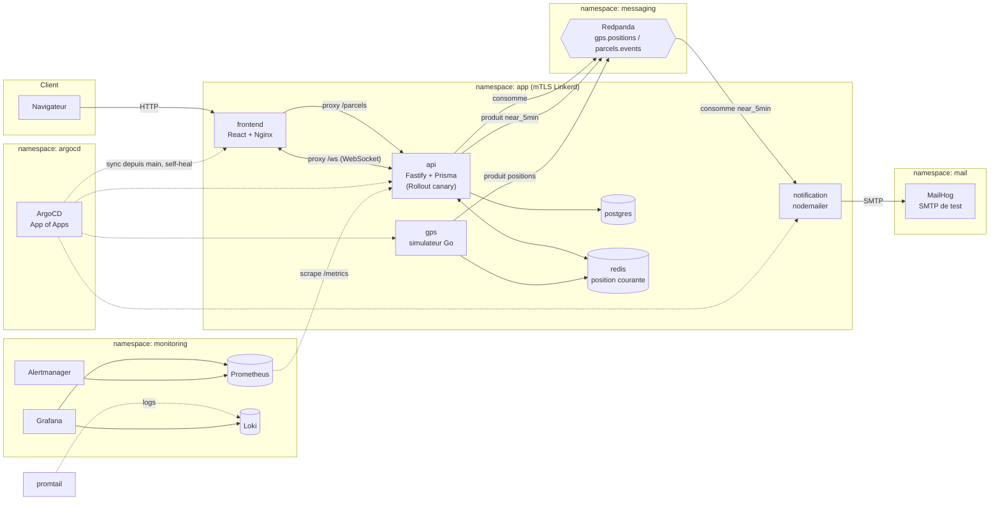
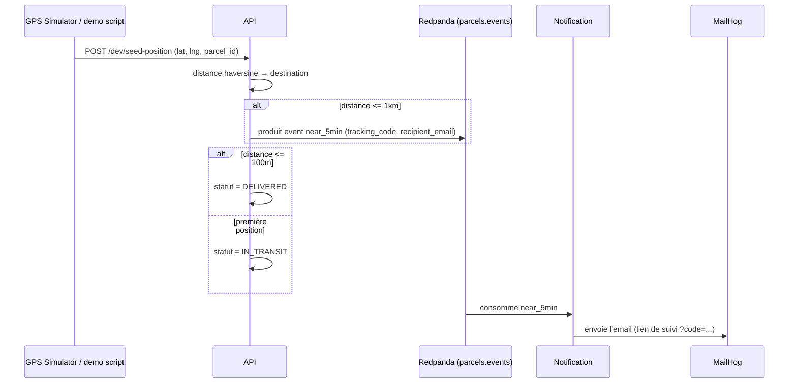
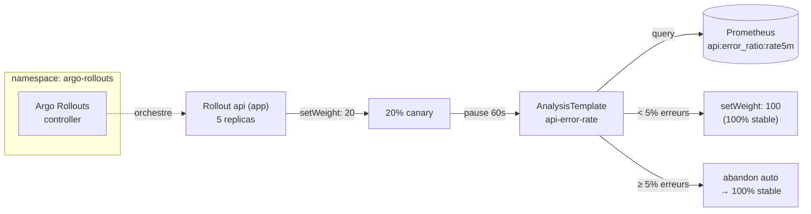
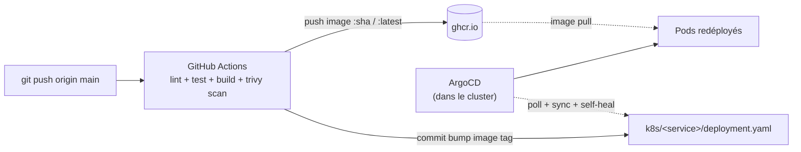

# Architecture — GreenLogistics

## Flux "notification d'arrivée"

## Canary — Argo Rollouts (service `api`)

Détails et alternatives évaluées : [ADR-7](ADR.md#adr-7--argo-rollouts-canary-basé-sur-les-replicas-plutôt-que-linkerd-smiistio).

## CI/CD — GitOps pull-based

